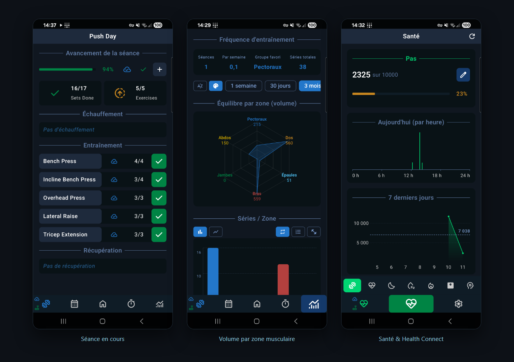
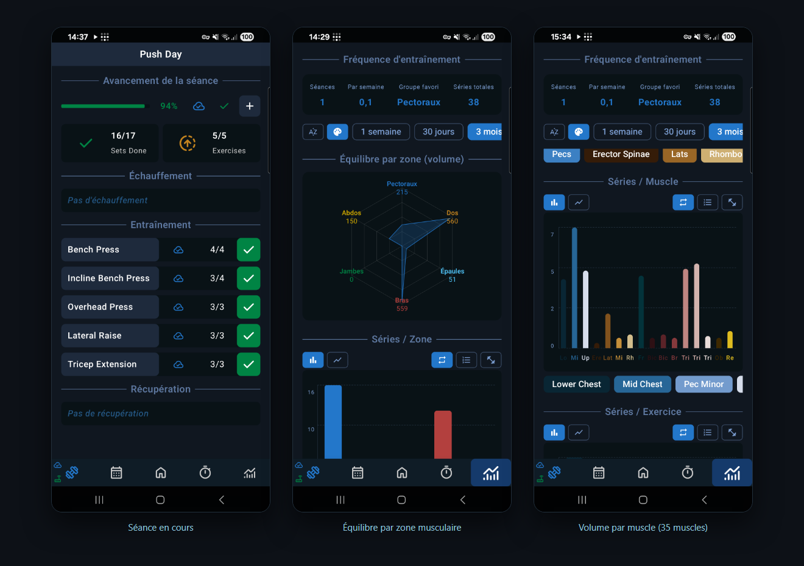
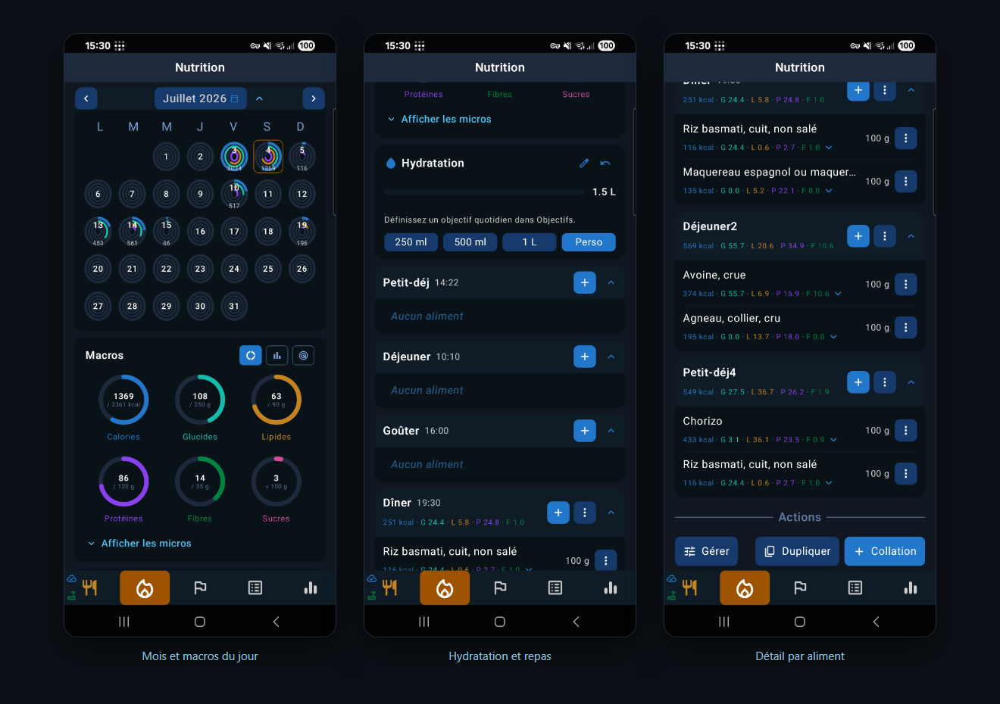
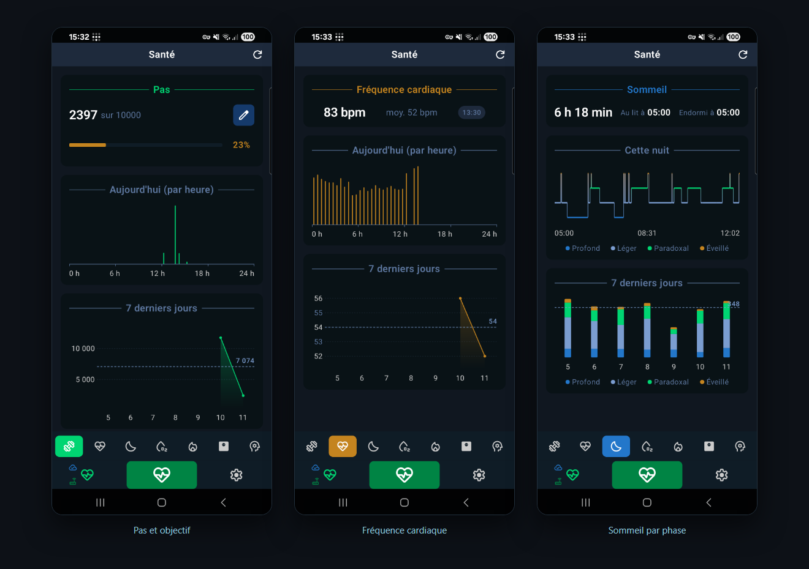
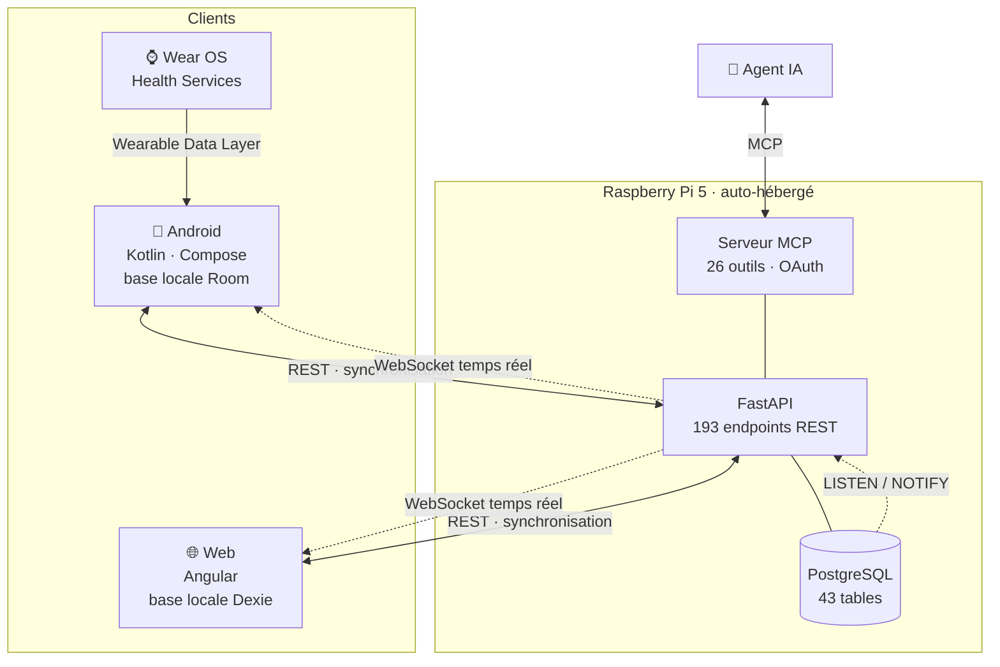

# Fit Tracker

**Une application de suivi sportif, nutritionnel et de santé, utilisable hors ligne sur quatre appareils qui restent synchronisés entre eux.**

Serveur FastAPI/PostgreSQL auto-hébergé sur Raspberry Pi, application Android, client web et application montre. En production et utilisé quotidiennement.



> [!NOTE]
> **Ce dépôt est un instantané public d'un dépôt de travail privé**, actif depuis 2025.
> Le code est publié intégralement ; l'historique des commits et la configuration
> d'infrastructure (hôtes, secrets, identifiants) restent privés. D'où l'unique commit
> initial : ce n'est pas un projet créé d'un bloc, c'est une photo d'un projet qui vit
> ailleurs. Le nom interne du projet est `sport-app`.

---

## Ce que ça fait

L'application accompagne une pratique sportive au quotidien, du suivi de la séance à l'assiette.

| Domaine | Contenu |
|---|---|
| **Entraînement** | Séances effectives, modèles de séance par jour, programmes pluri-hebdomadaires, supersets, dropsets |
| **Catalogue** | Exercices avec instructions, matériel possédé, taxonomie musculaire à **3 niveaux** (6 zones → 17 groupes → 35 muscles) avec coefficients de sollicitation par exercice |
| **Statistiques** | Volume travaillé par muscle, objectifs hebdomadaires, progression, graphiques |
| **Nutrition** | Journal de repas, calories, macros et micronutriments, recettes, scan de code-barres, hydratation |
| **Santé** | Pas, fréquence cardiaque, sommeil, SpO2, poids, stress — via Health Connect et la montre |
| **Outils** | Chronomètre et minuteur, routines et tâches récurrentes, notifications |

### Entraînement

Séance en cours avec ses phases, équilibre du volume par zone, et répartition fine sur les 35 muscles de la taxonomie.



### Nutrition

Vue mensuelle où chaque jour porte ses anneaux de macros, journal du jour avec hydratation et repas, puis détail par aliment.



### Santé

Données lues depuis Health Connect et la montre : pas et objectif, fréquence cardiaque par tranches de 30 minutes, sommeil décomposé par phase.



---

## Le point technique central : la synchronisation hors ligne

C'est le cœur du projet, et sa partie la plus difficile.

**Chaque client possède sa propre base de données locale** — Room sur Android, Dexie dans le navigateur — et c'est elle qui fait autorité pour l'interface. L'application fonctionne intégralement sans réseau : on enregistre une séance dans une salle sans couverture, et rien n'est perdu.

Quand le réseau revient, un **protocole convergent** réconcilie les modifications. Trois appareils ayant modifié les mêmes données hors ligne se retrouvent dans le même état, sans pierres tombales, en respectant les dépendances entre entités (un exercice ne peut pas être synchronisé avant la séance qui le contient).

Le même protocole est **réimplémenté sur deux piles différentes** : Kotlin avec Room côté Android, TypeScript avec Dexie côté web.

<!-- À VENIR — Démonstration de la synchronisation hors ligne (GIF).

-->

En complément, le **temps réel descendant** : des déclencheurs PostgreSQL émettent un `NOTIFY` à chaque modification de ligne, un écouteur les relaie vers un concentrateur WebSocket, et les clients concernés se rafraîchissent immédiatement. Une modification faite sur le web apparaît sur le téléphone sans action de l'utilisateur.

---

## Architecture



Le serveur est **auto-hébergé sur une Raspberry Pi 5**, accessible uniquement depuis un réseau privé Tailscale. Chaque `git push` déclenche un webhook qui met à jour le code, applique les migrations, reconstruit le client web et redémarre le service.

---

## Ce qui pourrait vous intéresser

**Le serveur MCP intégré.** L'application expose 26 outils via le Model Context Protocol, avec OAuth (PKCE et enregistrement dynamique de client), application de portées et journal d'audit. Un agent conversationnel peut donc consulter et modifier les données — « quel est mon volume sur les pectoraux cette semaine ? ».

**La sécurité par la propriété en cascade.** Aucun endpoint n'est public. Chaque route vérifie la chaîne de propriété jusqu'à l'utilisateur : on ne peut pas atteindre le set d'un autre utilisateur en devinant un identifiant, même en connaissant la structure.

**Un système de composants dupliqué volontairement.** Le design system existe en Compose et en CSS, avec les mêmes jetons, pour que les deux clients restent des jumeaux visuels. L'internationalisation EN/FR est obligatoire à chaque écran.

**Les migrations comme source de vérité.** Alembic côté serveur, migrations Room côté Android, avec des tests de migration sur appareil réel. Aucune création de schéma implicite.

<!-- À VENIR — Application montre.

-->

---

## Stack

| | |
|---|---|
| **Serveur** | Python · FastAPI · SQLAlchemy 2 (async) · asyncpg · PostgreSQL 18 · Alembic · pytest |
| **Android** | Kotlin · Jetpack Compose · Material 3 · Room · Hilt · Retrofit/OkHttp · DataStore · Vico |
| **Web** | Angular · TypeScript · Dexie · ECharts |
| **Montre** | Wear OS · Compose for Wear · Health Services · Wearable Data Layer |
| **Intégrations** | Health Connect · Open Food Facts · table CIQUAL · Model Context Protocol |
| **Exploitation** | Raspberry Pi 5 · systemd · Tailscale · déploiement automatique par webhook |

---

## Organisation du dépôt

```
serveur/            API FastAPI, modèles, migrations, serveur MCP, tests
appli-android/
  ├── app/          application Android (Kotlin/Compose)
  └── wear/         application montre (Wear OS)
appli-web/          client web (Angular)
docs/               documentation technique détaillée
```

La documentation interne est fournie telle quelle, en français : architecture, schéma de base de données, protocole de synchronisation, flux d'authentification, conception du serveur MCP. Voir [`docs/`](docs/).

---

## Quelques ordres de grandeur

| | |
|---|---|
| Tables PostgreSQL | 43 |
| Endpoints REST | 193 |
| Migrations Alembic | 33 |
| Tests serveur | 227 |
| Écrans Compose | 52 |
| Plateformes clientes | 4 |

---

## Faire tourner le projet

Le dépôt ne contient aucune configuration d'infrastructure. Pour un essai local :

```bash
# Serveur
cd serveur
python -m venv venv && venv/bin/pip install -r requirements.txt
cp .env.example .env          # renseigner DATABASE_URL et JWT_SECRET_KEY
python setup_db.py            # création idempotente du schéma
python -m uvicorn app.main:app --reload

# Client web
cd appli-web && npm install && npm start
```

L'application Android s'ouvre dans Android Studio. Les hôtes serveur se déclarent dans `appli-android/local.properties` :

```properties
server.dev.host=192.168.x.x:8000
server.pi.host=mon-hote.mon-tailnet.ts.net
```

Le guide complet est dans [`DEV_GUIDE.md`](DEV_GUIDE.md).

---

## Licence

MIT — voir [`LICENSE`](LICENSE).
