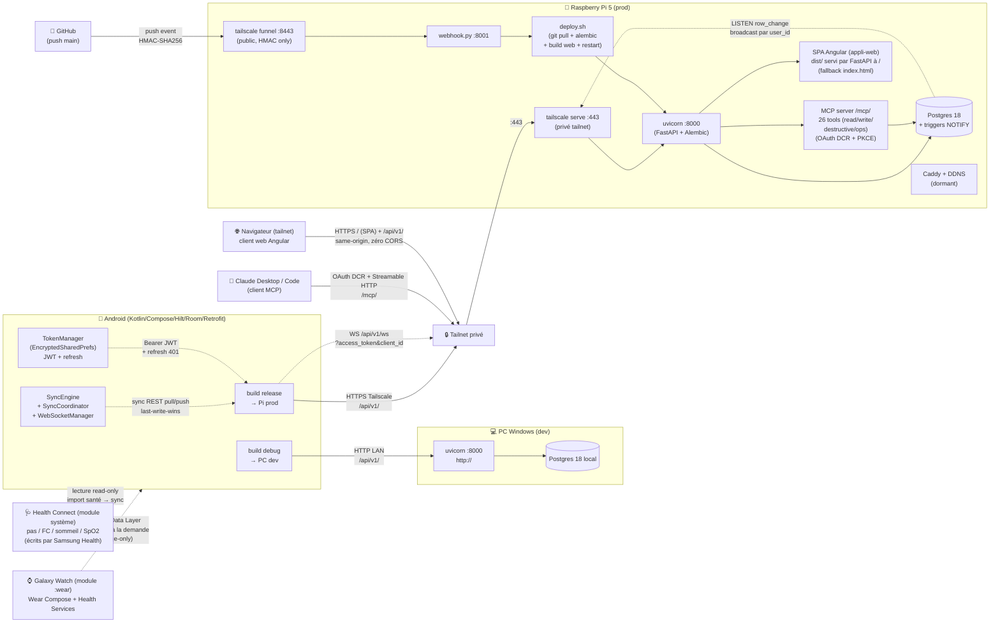
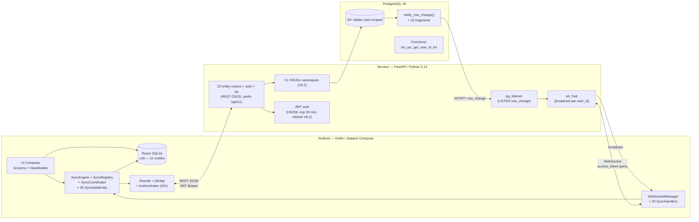
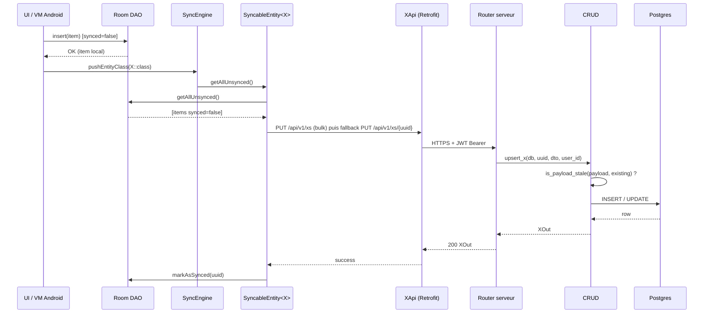
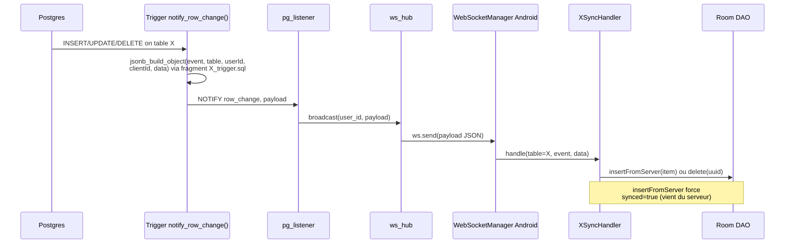
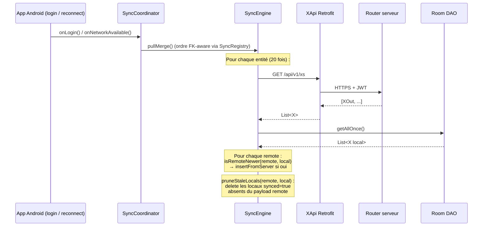
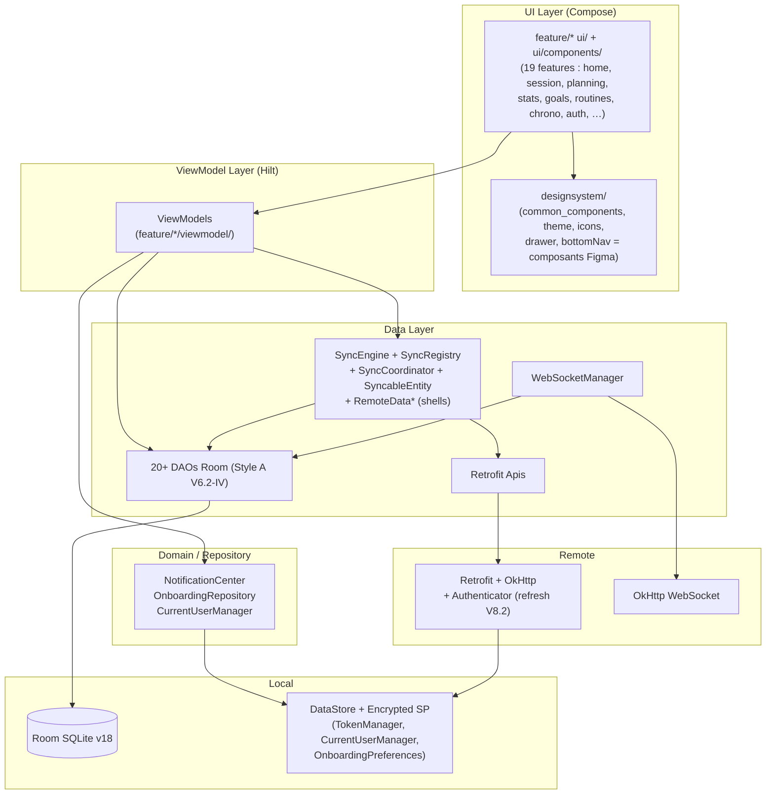
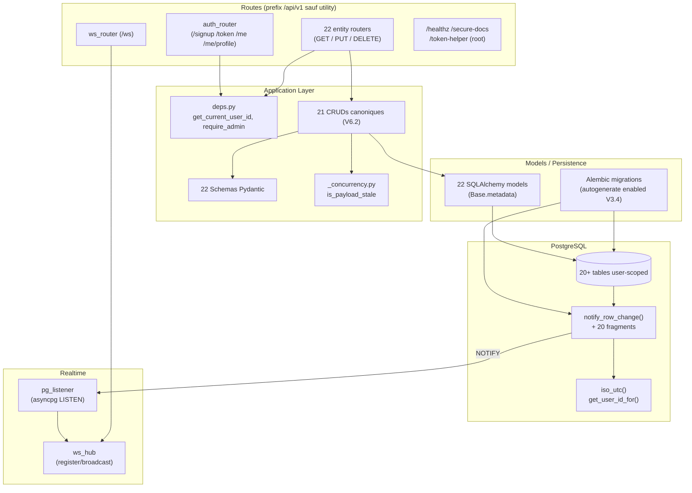
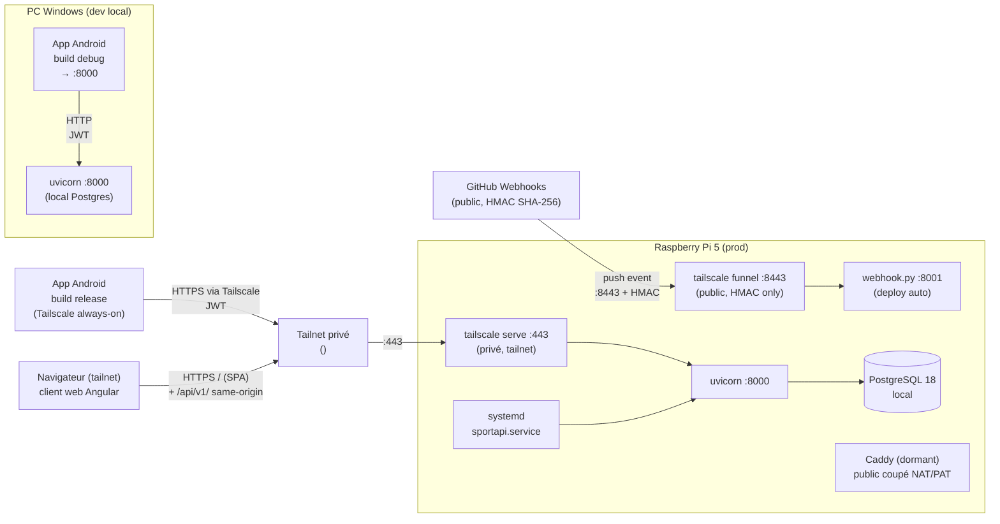

# Architecture — sport-app

Diagrammes Mermaid haut niveau de la stack et des flux.

> ⚠️ **Document vivant à maintenir en continu** — Ce diagramme d'architecture doit être tenu à jour automatiquement. Dès qu'un changement d'architecture est détecté (nouvelle entité majeure, nouveau service, refonte sync, changement réseau Tailscale/Caddy, nouveau flow auth, nouveau build variant), le mettre à jour dans le même commit que la modif technique, **sans attendre que l'utilisateur le demande**. Politique #19 (validée 2026-05-27).

> **À jour 2026-05-27.** Diagramme overview synthétique §0 ajouté (vue globale Android + Pi + PC dev + sync + WS + auto-deploy). Refonte sync layer Android post-T4.2 (2026-05-07) intégrée. Migration Tailscale §7 (2026-05-21) intégrée. Pour le tuto cross-stack d'ajout d'entité, voir [HOW_TO_ADD_ENTITY.md](HOW_TO_ADD_ENTITY.md). Pour le protocole sync, voir [SYNC_PATTERN.md](SYNC_PATTERN.md).

> **Maj 2026-05-31.** Migration Android **package-by-layer → package-by-feature** : top-level `app/ core/ designsystem/ feature/` (détail dans §5). Les couches (UI → ViewModel → Data) sont inchangées ; c'est leur organisation en packages qui change. Aucune dépendance feature↔feature.

> **Maj 2026-06-10.** Client web **`appli-web/` (Angular 22)** intégré : SPA servi par FastAPI **same-origin** à `/` sur la Pi (mount statique catch-all en fin de `main.py`, fallback `index.html`), build inséré dans `deploy.sh` (npm ci + build, Node 22). Déployé en prod le 2026-06-08. MCP : 26 tools (et plus 18).

> **Maj 2026-07-03.** Domaine **Santé / Health Connect** : 3 tables serveur (`health_step_counts`, `health_metrics`, `health_goals`) + endpoints `/api/v1/health-*` + miroir Room/sync Android (v23) ; l'app lit Health Connect (source effective : Samsung Health) et importe vers la Pi à chaque sync. Nouveau module **`:wear`** (app Galaxy Watch, Wear OS Compose + Health Services) : canal **Wearable Data Layer** montre ↔ téléphone — stream 1×/s au premier plan + pull à la demande (`WearableListenerService`, réveil app fermée), **affichage-only** (Health Connect reste la source persistée, anti double-comptage).

## §0 — Overview synthétique (vue globale)

Diagramme global qui rassemble en une seule vue : Android client (2 build variants) + client web Angular (SPA servi par FastAPI same-origin) ↔ Pi prod (Tailscale-only) + PC dev (HTTP LAN) + flow auth JWT + sync REST pull/push + WebSocket realtime + auto-deploy webhook GitHub + serveur MCP (sous-app `/mcp/`, 26 tools, OAuth DCR, clients Claude Desktop/Code via tailnet). Les §1-§7 ci-dessous détaillent chaque facette.

Légende :
- Trait plein = HTTP/HTTPS standard
- Trait pointillé = flux applicatif (sync, WS, auth refresh, broadcast realtime)
- `tailscale serve` = endpoint **privé** (tailnet uniquement, accessible aux devices liés au compte)
- `tailscale funnel` = endpoint **public** (Internet) limité au webhook GitHub avec HMAC obligatoire
- Public `<public-dns>` + Caddy : dormants depuis migration Tailscale (2026-05-21)

## §1 — Stack haut niveau

Stack :
- **Mobile** : Kotlin · Jetpack Compose · Hilt · Room · Retrofit · OkHttp · DataStore
- **Web** : Angular 22 (zoneless) · TypeScript · Dexie (offline) · echarts — SPA buildé dans `appli-web/dist/`, servi par FastAPI same-origin à `/` (mount statique, fallback `index.html`)
- **Backend** : FastAPI · Python 3.14 · SQLAlchemy 2 (async) · asyncpg · Alembic · WebSockets natifs · slowapi (rate limit) · GZipMiddleware
- **DB** : PostgreSQL 18 (prod : Raspberry Pi 5)

## §2 — Flux sync montante (Android → Serveur)

## §3 — Flux sync descendante WebSocket (push realtime)

Garanties :
- `clientId` du payload = client qui a déclenché le change. Les autres devices du même user reçoivent l'event ; le client source peut l'ignorer (déjà à jour localement).
- Si le client est déconnecté : pas de catch-up automatique → `SyncEngine.pullMerge()` au reconnect (V4.4).

## §4 — Flux sync descendante REST batch (catch-up)

Déclencheurs :
- `AuthManager.onLogin` après login (V4.4)
- `NetworkMonitor.onAvailable` après reconnexion (V4.4)
- Boutons explicites dans Settings (`RemoteData*` shells)

## §5 — Couches Android (architecture interne)

Conventions :
- **Organisation des packages (package-by-feature, depuis 2026-05-31)** : `app/` (shell : MainActivity, SportApp, SnackbarController, navigation) · `core/` (data, network, sync, domain, utils, di, stats — tout le non-UI partagé, ex-`data/`/`sync/`/`utils/`/`domain/`) · `designsystem/` (UI réutilisable = composants Figma) · `feature/*` (19 features auto-contenues : chacune `ui/` + `ui/components/` + `viewmodel/`). `R`/`BuildConfig` restent au package racine `com.example.sportapp`. Zéro dépendance feature↔feature (un type partagé comme `StatsRange` vit dans `core/stats`).
- ViewModels n'importent **jamais** de la couche network (Authenticator), Room types primitifs uniquement.
- DAOs Style A V6.2-IV : wrappers publics posent `synced=false + updatedAt = getNowISO8601()`, délégation à `*Internal` Room-annoté ; `*FromServer` pour préserver les payloads serveur (force `synced=true`).
- i18n EN/FR obligatoire (politique 18) : `stringResource(R.string.xxx)` partout dans Compose ; locale switching via `CompositionLocalProvider` dans `MainActivity`.

## §6 — Couches serveur (architecture interne)

Politiques cross-cutting (cf. [CLAUDE.md](../CLAUDE.md)) :
- §8 sécurité : auth obligatoire + cascade ownership + `require_admin` pour Type C
- §9 squelette uniforme par module type
- §10 defaults DB sémantiques uniquement
- §11 UPPER_CASE pour les états (cross-stack)
- §16 Alembic source de vérité (pas de `Base.metadata.create_all` hors bootstrap)
- §17 snake_case wire serveur + alias camelCase JSON

## §7 — Topologie déploiement (post-migration Tailscale 2026-05-21)

- **Build debug** Android → `http://<pc-lan-ip>:8000/api/v1/` (PC dev local sur LAN)
- **Build release** Android → `https://<pi-fqdn>/api/v1/` (Pi via Tailscale serve, port 443)
- **Client web** → `https://<pi-fqdn>/` (SPA Angular servi par FastAPI same-origin : zéro CORS, WS `/api/v1/ws` direct ; build via étape npm de `deploy.sh`, Node 22 requis sur la Pi)
- **Public coupé** : NAT/PAT Livebox port 80/443 désactivés ; Caddy + DDNS `<public-dns>` restent dormants (réactivables en 2 clics).
- **Webhook GitHub** : `https://<pi-fqdn>:8443/webhook/deploy` (via `tailscale funnel`, HMAC vérifié par `webhook.py`).
- Setup détaillé : [`DEV_GUIDE.md`](../DEV_GUIDE.md) §10 · [`TAILSCALE_MIGRATION.md`](TAILSCALE_MIGRATION.md).
