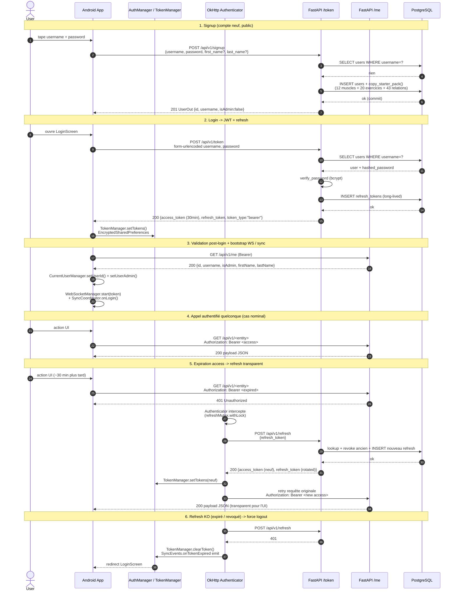

# AUTH_FLOW — Diagramme séquence

Flow d'authentification JWT bout-en-bout entre l'app Android et le serveur FastAPI : signup, login, accès authentifié, expiration `access_token` (~30 min) et refresh transparent via `Authenticator` OkHttp. Complète [FLOWS.md §1](FLOWS.md) (vue curl/JSON) avec une vue temporelle des acteurs.

## Diagramme

## Notes

- **V8.4 pre-seed signup** : `copy_starter_pack(db, user.id)` (étape 1) copie en transaction le catalogue starter dans les tables user-scoped (12 muscles + 20 exercices + 43 relations `exercise_muscle`). Si la table starter n'est pas seedée → `503 Service Unavailable` + rollback (pas de username squatté).
- **EncryptedSharedPreferences (V8.2)** : `access_token` + `refresh_token` chiffrés au repos via clés Android Keystore — survit aux cold-starts sans réauth.
- **`refreshMutex.withLock`** ([RetrofitInstance.kt:112](../appli-android/app/src/main/java/com/example/sportapp/network/RetrofitInstance.kt)) : un seul `POST /refresh` concurrent même si N requêtes parallèles déclenchent un 401 simultané → évite la reuse-detection côté serveur (qui révoque toutes les sessions si elle voit un refresh deux fois).
- **Reuse detection** : si un refresh déjà révoqué est présenté, le serveur révoque **tous** les tokens du user (vol présumé) → next call → force logout client-side.
- **401 vs 403** : `401` = token absent / expiré / invalide (déclenche refresh). `403` = token valide mais cross-user ou non-admin sur Type C (pas de refresh, juste snackbar erreur).

## Sources

- `serveur/app/routers/auth_router.py` — `/signup`, `/token`, `/refresh`, `/logout`, `/me`, `/me/profile`, `/me` (DELETE).
- `appli-android/.../auth/AuthManager.kt` — `initAuth()` / `stopAuth()`, orchestration WS + merge initial.
- `appli-android/.../network/RetrofitInstance.kt` — `authAuthenticator` (401 → refresh sous mutex), `authInterceptor`, `clientIdInterceptor`.
- `appli-android/.../network/TokenManager.kt` — persistance EncryptedSharedPreferences.
- [FLOWS.md §1](FLOWS.md) — variante curl/JSON.
