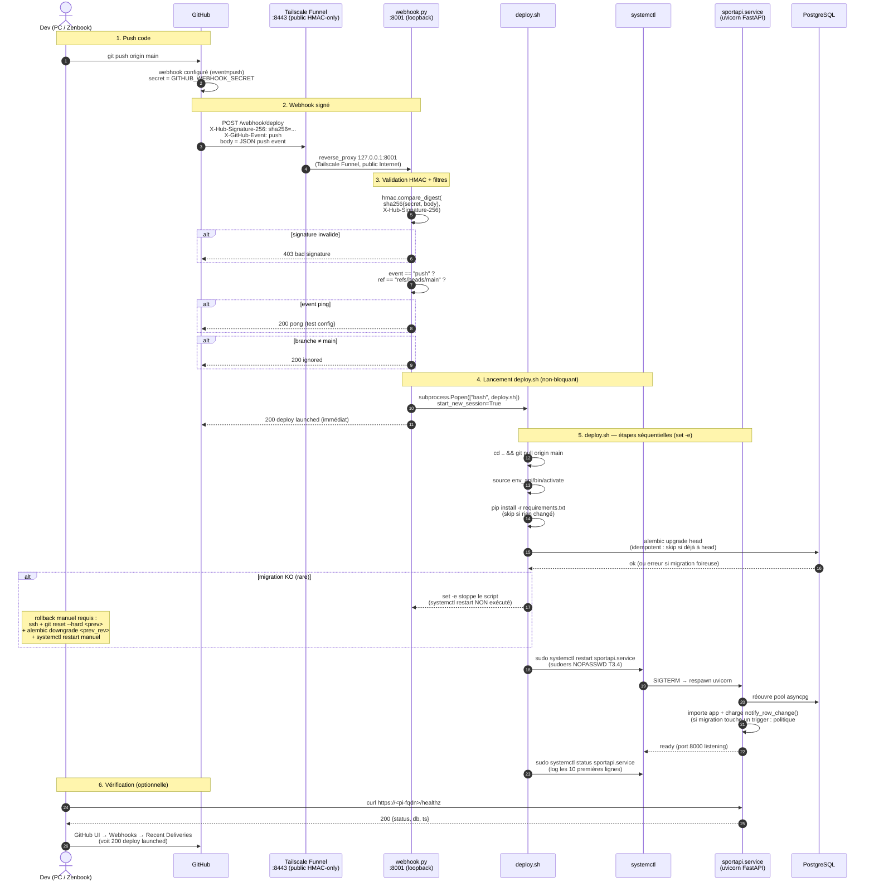

# DEPLOY_FLOW — Diagramme séquence

Flow d'auto-déploiement Pi sur push `main` (T3.1, 2026-05-07) : GitHub envoie un webhook signé HMAC-SHA256 vers Tailscale Funnel, le service `webhook.py` valide la signature et lance `deploy.sh` en arrière-plan (`git pull` + `pip install` + `alembic upgrade head` + `systemctl restart sportapi`). Permet de pousser des changements serveur depuis n'importe quel device (PC, Zenbook mobilité 4G) sans SSH manuel.

## Diagramme



## Notes

- **Tailscale Funnel** : `:8443` exposé sur l'Internet public uniquement pour ce webhook (cf. [TAILSCALE_MIGRATION.md](TAILSCALE_MIGRATION.md)). Tout le reste (API `/api/v1/*`, WS) est en `tailscale serve` privé (tailnet-only depuis 2026-05-21).
- **HMAC-SHA256** : secret partagé GitHub ↔ Pi (`GITHUB_WEBHOOK_SECRET` dans `/home/william/.config/sportapi-webhook.env`, perms 600, chargé par `EnvironmentFile=` systemd). `hmac.compare_digest` = comparaison constante-time (anti-timing-attack).
- **Non-bloquant** : `subprocess.Popen(..., start_new_session=True)` détache `deploy.sh` du process webhook → la réponse 200 est immédiate (sinon GitHub timeout 10s sur le ping). Le déploiement effectif prend 20-40s en arrière-plan.
- **`set -e`** : `deploy.sh` stoppe à la première commande qui échoue → si `pip install` ou `alembic upgrade head` échoue, le `systemctl restart` n'est **pas** exécuté → le service tourne encore sur l'ancien code (état dégradé mais fonctionnel).
- **Reload triggers post-migration** (politique #15) : si une migration Alembic rename/drop une colonne référencée dans un fragment trigger SQL, la migration elle-même fait `op.execute(compose_function_sql())` → recharge `notify_row_change()` en mémoire Postgres. Pas besoin de step manuel dans `deploy.sh`.
- **Logs** : `journalctl -u sportapi-webhook -f` pour le webhook (HMAC OK/KO, deploy lancé), `journalctl -u sportapi -f` pour le service FastAPI (startup, requêtes, exceptions).

## Rollback manuel

Si `alembic upgrade head` casse :

```bash
ssh william@<pi-fqdn>  # ou <pi-lan-ip> en LAN
cd ~/Applications/sport-app
git log --oneline -5                  # repérer le commit sain précédent
git reset --hard <prev-sha>
cd serveur
source env_api/bin/activate
alembic downgrade <prev-revision>     # cf. alembic history
sudo systemctl restart sportapi.service
sudo systemctl status sportapi.service --no-pager | head -10
```

Note : `git reset --hard` local sur la Pi **uniquement** — ne pas push force le main GitHub depuis la Pi (le PC dev a probablement déjà avancé). Le webhook s'auto-déclenchera au prochain push correctif côté dev.

## Sources

- `serveur/webhook/webhook.py` — HTTP server stdlib, HMAC validation, Popen non-bloquant (~100 lignes).
- `serveur/deploy.sh` — git pull + pip + alembic + systemctl restart.
- `serveur/webhook/sportapi-webhook.service` (sur la Pi) — systemd unit avec `EnvironmentFile=`.
- Caddy config Pi (`/etc/caddy/Caddyfile`) — `reverse_proxy /webhook/deploy 127.0.0.1:8001` (dormant depuis migration Tailscale, mais structure préservée).
- Sudoers `/etc/sudoers.d/sportapi` (T3.4, 2026-05-07) — NOPASSWD pour `systemctl restart/status/journalctl sportapi*`.
- Historique CLAUDE.md 2026-05-07 entrée T3.1 — install procédure complète.
