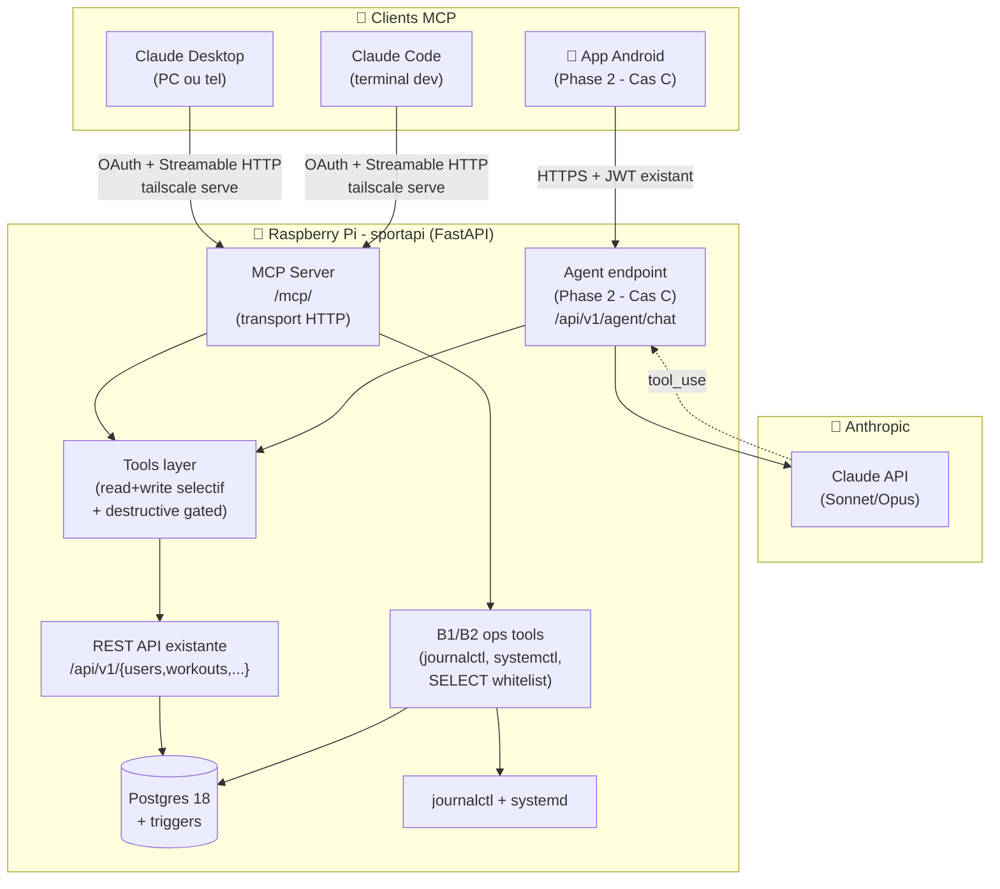
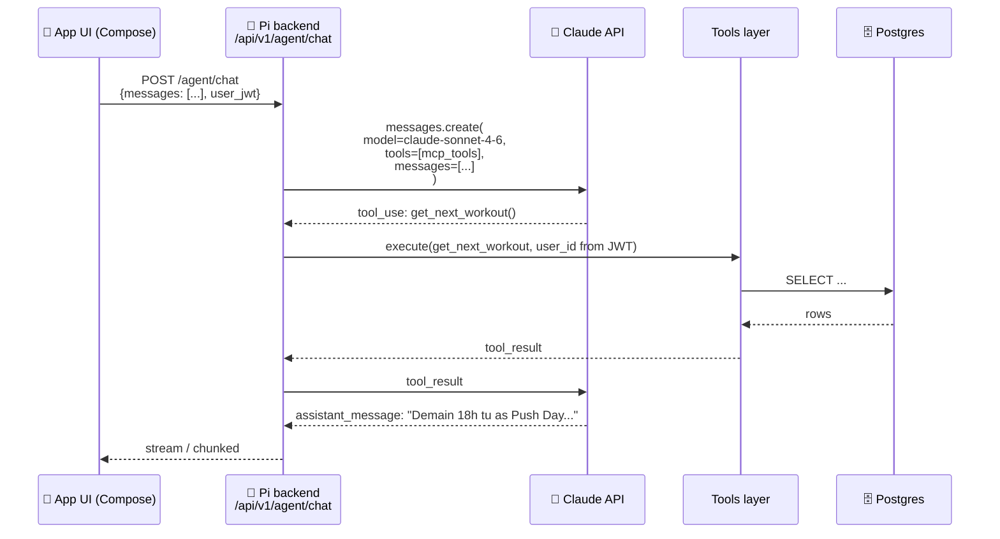
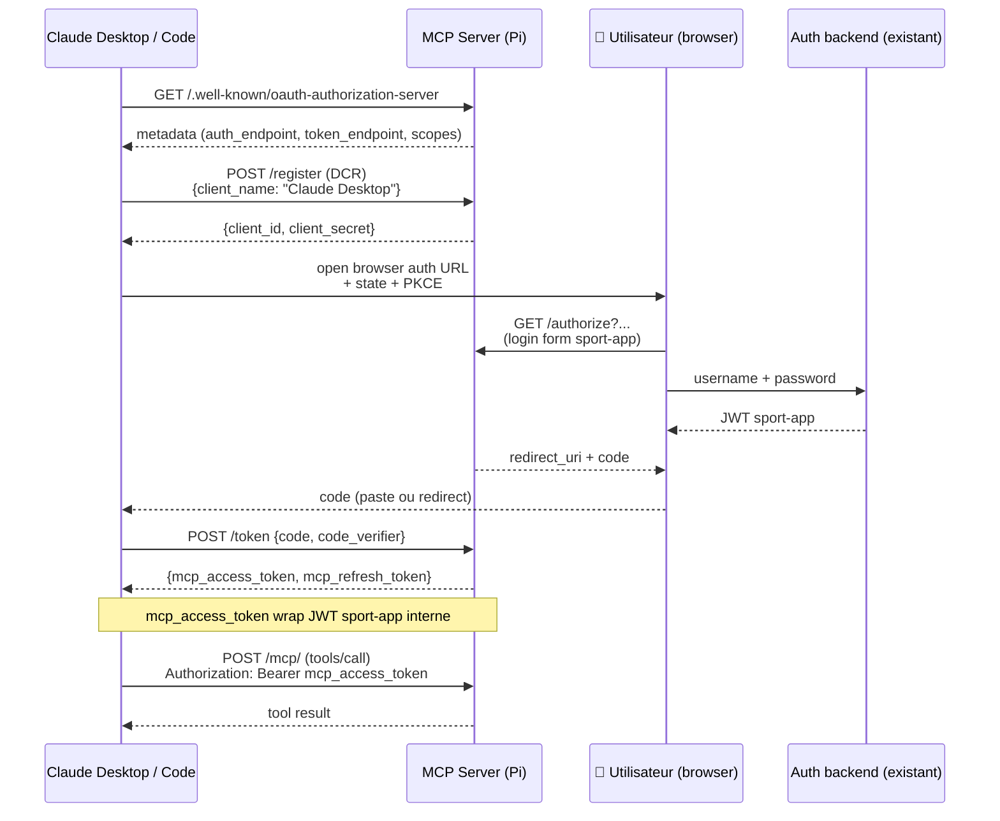

# MCP sport-app — Design doc

> **Statut : DESIGN VALIDÉ — prêt pour implémentation, aucune ligne de code encore.** Session de réflexion 2026-05-27 + décisions Q1-Q8 actées le même jour.
> Source de référence pour la tâche Notion ["Serveur MCP sport-app (assistant conversationnel IA via Claude Desktop ou autre)"](https://www.notion.so/36b1776cd0e281e9bf5de3d1522ff27a).
>
> Ce document scope **3 cas d'usage** (A, B, C) d'un serveur MCP exposé par la stack sport-app, leurs interactions, l'architecture cible, l'auth multi-user, la sécurité et le phasing. Toutes les décisions structurelles Q1-Q8 sont actées (§10). Il sera **converti en sous-tâches d'implémentation** quand la priorité de la tâche remontera (aujourd'hui 🟢 Basse).

## §0 — TL;DR

| Cas | Description | Client typique | Phase |
|---|---|---|---|
| **A** — MCP data sport | Tools MCP qui exposent les données workout (read + write sélectif). Destructive ops (delete, admin) gated par confirm. | Claude Desktop (tel/PC), Claude Code (terminal dev) | **Phase 1 — MVP** |
| **B1** — MCP dev runtime read-only | Tools MCP qui exposent du runtime Pi : `journalctl`, `systemctl status`, `SELECT` SQL whitelisted, healthcheck. | Claude Code (= Claude lui-même en session dev) + Claude Desktop pour debug | **Phase 1 — MVP** |
| **B2** — MCP dev runtime ops controlled | Actions whitelisted destructives : restart service, alembic upgrade, reload triggers. Toutes en `destructiveHint=true`. | Idem B1 | **Phase 2 — Optional** (Termius via Tailscale couvre déjà 95%) |
| **C** — Agent IA in-app Android | UI "Ask AI" dans l'app Android. App → backend Pi → Anthropic API (Claude) → tools MCP → DB. | Utilisateur final dans l'app | **Phase 2 — Feature séparée, design partagé** |

**Décisions actées dans cette session** :
- Auth = multi-user dès le départ (OAuth Dynamic Client Registration, style Notion MCP) — pas de single-user bypass.
- Déploiement = même process FastAPI sur la Pi (route mountée dans l'app existante).
- LLM Cas C = Anthropic Claude API côté backend (clé dans `.env` Pi, jamais dans l'APK).
- Droits Cas A = read + write sélectif + tools destructifs gated `destructiveHint=true` (delete + admin).
- Cas B1 inclus dès la Phase 1 (vraie valeur pour autonomie post-deploy de Claude Code).

## §1 — Pourquoi ?

### §1.1 — Cas A : pourquoi un MCP plutôt qu'un client REST custom ?

Aujourd'hui, pour répondre à « ma prochaine séance ? » ou « volume hebdo chest ce mois ? », il faut :
- ouvrir l'app Android → calendrier → cliquer le jour → lire ;
- ou faire un `curl /api/v1/...` avec JWT bearer (geek-only) ;
- ou ouvrir l'écran Stats et changer la granularité manuellement.

Avec un MCP exposé, **n'importe quel client MCP** (Claude Desktop sur tel/PC, Claude Code en terminal, demain ChatGPT/Cursor/etc.) peut interroger les données en langage naturel. Le LLM choisit lui-même quel tool appeler. Pas d'UI à coder côté client.

### §1.2 — Cas B1 : pourquoi un MCP dev runtime ?

Quand Claude Code (= moi) pousse un fix backend, le webhook GitHub déclenche `deploy.sh` sur la Pi. Aujourd'hui, pour **valider** que le déploiement a marché, il faut :
- soit que l'utilisateur SSH avec Termius et copie-colle `journalctl -u sportapi -n 50` ;
- soit qu'on attende un retour utilisateur sur runtime ("ça marche !" ou "ça crashe").

Avec MCP B1, Claude Code peut **lui-même** : `mcp.tools.get_service_status(name="sportapi")` + `mcp.tools.get_recent_logs(unit="sportapi", since="2min")` + `mcp.tools.healthcheck()` post-deploy. Si une exception apparaît, il propose direct un fix. L'utilisateur n'est dérangé qu'en cas de vraie ambiguïté.

### §1.3 — Cas C : pourquoi un agent IA dans l'app ?

UX cible : pendant une séance, l'utilisateur dit « ajoute 3 sets de 10 reps à 80 kg sur ma série en cours », sans naviguer dans 4 écrans. Ou « rappelle-moi ce que j'ai poussé au bench la semaine dernière ». L'agent IA in-app utilise les mêmes tools MCP que le Cas A — la valeur de MCP est précisément cette **mutualisation** des tools entre clients externes (Claude Desktop) et clients internes (notre app).

## §2 — Architecture globale

**Points clés du schéma** :

- **Un seul process FastAPI** sur la Pi expose 3 surfaces : REST API existante (`/api/v1/`), MCP server (`/mcp/`), Agent endpoint Phase 2 (`/api/v1/agent/chat`).
- **Tools layer = couche partagée** entre MCP et Agent : un tool `get_next_workout(user_id)` est définissable une fois et utilisé par les deux. Sous le capot il réutilise les CRUDs SQLAlchemy existants (pas de re-réécriture). C'est ce qui rend la mutualisation A ↔ C "gratuite".
- **OAuth Dynamic Client Registration** pour MCP : Claude Desktop / Code se déclarent comme client auprès du serveur MCP, l'utilisateur fait une auth (login sport-app) dans un popup navigateur, le serveur émet un token MCP qui wrap un JWT sport-app.
- **App Android Phase 2** : pas de re-auth, elle utilise son JWT existant directement contre `/api/v1/agent/chat` (pas besoin d'OAuth in-app).

## §3 — Cas A — MCP data sport

### §3.1 — Tools exposés (proposition)

Read tools (safe par défaut) :

| Tool | Signature | Description |
|---|---|---|
| `list_workouts` | `(start_date, end_date)` | Workouts dans une plage de dates |
| `get_workout` | `(workout_uuid)` | Détail d'un workout (exercices + sets) |
| `get_next_planned_workout` | `()` | Prochaine séance planifiée |
| `get_weekly_volume` | `(muscle_name, weeks=4)` | Volume hebdo par muscle (sets/reps/charge) |
| `get_exercise_history` | `(exercise_name, limit=20)` | Dernières perfs sur un exercice |
| `get_muscle_goals_progress` | `(week_offset=0)` | % atteinte hebdo par muscle |
| `search_exercises` | `(query)` | Recherche dans le catalogue exercices |
| `get_available_equipment` | `()` | Équipement dispo de l'user |
| `list_muscles` | `()` | 35 muscles précis + groupes + zones |

Write tools (sélectifs, **non destructifs**) :

| Tool | Signature | Description |
|---|---|---|
| `mark_set_done` | `(set_uuid, actual_reps, actual_weight)` | Termine un set en cours |
| `create_actual_workout` | `(date, name, exercises)` | Crée une séance ad-hoc |
| `add_exercise_to_workout` | `(workout_uuid, exercise_uuid, target_sets, target_reps)` | Ajoute un exercice à une séance |
| `update_muscle_goal` | `(muscle_uuid, target_sets, priority)` | Modifie un objectif hebdo |
| `add_notification` | `(title, body, scheduled_at)` | Crée une notif |
| `tick_routine_task` | `(task_uuid, date)` | Coche une tâche routine du jour |

Destructive tools (**`destructiveHint: true`** → confirm client requis) :

| Tool | Signature | Description |
|---|---|---|
| `delete_actual_workout` | `(workout_uuid)` | Supprime une séance |
| `delete_exercise` | `(exercise_uuid)` | Supprime un exercice du catalogue user |
| `delete_muscle_goal` | `(muscle_uuid)` | Supprime un objectif |
| `bulk_delete_notifications` | `(filter)` | Suppression batch notifs |

Admin tools (require `User.is_admin=true` + `destructiveHint: true`) :

| Tool | Signature | Description |
|---|---|---|
| `admin_promote_user` | `(user_id, is_admin)` | Promote / demote (politique self-protect + last-admin) |
| `admin_list_users` | `()` | Liste tous les users |
| `admin_seed_starter_pack` | `(user_id)` | Re-seed starter template pour un user |

### §3.2 — Convention de nommage des tools

- Verbes en `snake_case` (cohérent avec l'API REST snake_case Pydantic wire — politique 17).
- Préfixe `admin_` obligatoire pour les tools require_admin.
- Préfixe `bulk_` pour les opérations batch.
- Signatures alignées sur les schémas Pydantic existants (réutilisation directe via `model_json_schema()`).

### §3.3 — Cascade ownership & sécurité

Le tools layer **n'expose jamais `user_id` comme paramètre client** (politique 8 CLAUDE.md). L'`user_id` est dérivé du token MCP via `Depends(get_current_user_id)`, exactement comme l'API REST. Conséquence : un tool comme `get_workout(workout_uuid)` raise 404 si le workout appartient à un autre user, **automatiquement**, sans logique custom à ajouter.

## §4 — Cas B1 — MCP dev runtime read-only

### §4.1 — Tools exposés (proposition)

| Tool | Signature | Description |
|---|---|---|
| `get_service_status` | `(name="sportapi")` | `systemctl status` → uptime, active state, restart count |
| `get_recent_logs` | `(unit="sportapi", since="5min", limit=200)` | `journalctl -u <unit> --since <since> -n <limit>` |
| `healthcheck` | `()` | `GET /healthz` + smoke 2-3 endpoints + check Postgres connect |
| `db_schema_info` | `(table?)` | Liste tables / colonnes / indexes (lecture `information_schema`) |
| `get_table_row_count` | `(table)` | Compte de lignes d'une table whitelist (users, workouts, exercises, etc.) |
| `get_db_size` | `()` | Taille DB + par table (top 10) |
| `get_user_activity_summary` | `(user_id?)` | Workouts + sets sur les 30 derniers jours pour 1 user ou agrégé |
| `get_alembic_status` | `()` | Version courante + heads dispo |
| `get_recent_deploys` | `(limit=10)` | Lecture log webhook (date, commit SHA, succès/échec) |

> **Décision Q4 (2026-05-27)** : pas de `db_query_select` à SQL libre. Trop risqué (un LLM peut faire un JOIN déraisonnable qui sature la DB). On commence avec ces tools spécialisés safe-only, et on en ajoute à la demande quand un besoin réel apparaît.

### §4.2 — Restrictions de sécurité

- **Tous gated par `User.is_admin=true`** côté token MCP. Un user non-admin (`bob`) ne voit même pas l'existence de ces tools.
- **Pas de SQL libre** (cf. §4.1 décision Q4) — tous les tools data sont des queries SQL pré-écrites côté serveur, paramétrées seulement par les arguments du tool. Surface d'attaque réduite, perf prédictible.
- **`get_recent_logs` filtré** : pas de lecture du `.env` Pi via `journalctl` (les secrets ne sont pas loggés mais par défense en profondeur, redact regex sur output).
- **`get_table_row_count`** : whitelist explicite des tables consultables (les 22 tables métier), pas `information_schema` ni `pg_*`.

### §4.3 — B2 ops controlled (différé, mention seulement)

Si B2 est ouvert un jour, les tools seraient `restart_service`, `run_alembic_upgrade`, `reload_db_triggers`. **Tous** `destructiveHint: true`. Mais comme Termius via Tailscale couvre déjà ces ops, B2 reste optionnel — décision repoussée à l'usage réel de B1.

## §5 — Cas C — Agent IA in-app Android

### §5.1 — Flow

### §5.2 — Décisions design

- **Clé Anthropic dans `.env` Pi** uniquement. L'APK ne contient jamais de clé. L'app envoie juste le message + son JWT sport-app. Le backend orchestre l'appel Claude API + tool execution.
- **Réutilisation 100% du tools layer du Cas A** : ce que l'agent IA peut faire = exactement le set de tools Cas A. Un seul endroit à maintenir.
- **Streaming** côté backend → app : `text/event-stream` (SSE) ou WebSocket existant (réutiliser `/api/v1/ws` avec un type de message dédié).
- **Pas de gestion conversation persistante MVP** : on stocke 0 message côté serveur. L'app garde l'historique locale en SharedPreferences/Room. Phase ultérieure : table `agent_conversations` si besoin.
- **Rate limit** : slowapi (déjà installé V8.2) — limite genre 30 req/min/user pour éviter d'exploser la facture Anthropic.

### §5.3 — UI Compose (hors scope ce doc, mention)

Bouton "Ask AI" floating, écran `ChatScreen` LazyColumn streaming. Détails à scoper dans une tâche Notion séparée "B5 — UI agent IA in-app" quand on passera Phase 2.

## §6 — Transport MCP & auth OAuth

### §6.1 — Choix transport

Le MCP SDK Python officiel supporte 3 transports :
- `stdio` : process spawné en sous-process par le client. **Hors sujet** ici (Pi distante).
- `SSE` (Server-Sent Events) : déprécié dans les specs MCP récentes.
- **`Streamable HTTP`** : recommandé par Anthropic depuis 2025. POST pour requêtes, response SSE pour streaming. C'est ce qu'on prend.

Endpoint : `https://<pi-fqdn>/mcp/` (route mountée dans le FastAPI Pi).

### §6.2 — OAuth multi-user

Flow standard MCP avec **Dynamic Client Registration (DCR)** :

**Note design** : on **wrap** le JWT sport-app existant dans un token MCP, on ne réinvente pas l'auth. Le `mcp_access_token` est un **JWT signé HS256** (décision Q2, 2026-05-27) — même algo et même signature key que `/api/v1/token`, payload étendu avec `client_id` MCP + `scopes` accordés. Stateless, pas de lookup DB à chaque tool call. La table `mcp_sessions` sert uniquement à la révocation (UI admin) et à l'audit, pas au check de chaque requête. **TTL** : access 1h + refresh 30 jours (décision Q3, cohérent avec V8.2). Refresh automatique côté client MCP : quand l'access token expire (401), le SDK MCP utilise le refresh_token pour en obtenir un nouveau sans intervention utilisateur.

### §6.3 — Scopes OAuth proposés

| Scope | Couvre | Tools concernés |
|---|---|---|
| `sport:read` | Lecture data sport | Cas A read tools |
| `sport:write` | Écriture non destructive | Cas A write tools |
| `sport:destructive` | Delete / admin | Cas A destructive + admin tools (require_admin déjà gated DB-side) |
| `ops:read` | Runtime read-only Pi | Cas B1 |
| `ops:destructive` | Ops controlled | Cas B2 (Phase 2) |

Au moment du consent OAuth, l'utilisateur voit explicitement quels scopes l'app demande.

## §7 — Sécurité — checklist

- [x] **Cascade ownership respectée** : tools layer dérive `user_id` du token MCP, jamais du payload — politique 8 (read+write+destructive valident l'ownership, tests isolation cross-user).
- [x] **`destructiveHint: true`** annoté sur les 4 tools delete — le client MCP affiche un confirm dialog avant exécution.
- [x] **Pas de SQL libre** côté Cas B1 (décision Q4) — tools spécialisés safe-only seulement.
- [x] **`require_admin`** sur tous les tools B1 (`app/mcp/tools/sport_dev.py:require_admin`). Admin tools Cas A (`admin_*`) non encore implémentés.
- [ ] **Rate limit slowapi** sur `/mcp/` (anti-abuse) + sur `/api/v1/agent/chat` (anti-cost-bomb Anthropic). *(non fait)*
- [ ] **Clé Anthropic** stockée `.env` Pi `chmod 600`, jamais dans l'APK ni dans Git. *(Cas C, Phase 2)*
- [x] **Tokens MCP** : JWT signé HS256, table `mcp_sessions` pour révocation (scaffold).
- [x] **Audit log** : table `mcp_audit_log` logge tous les tool calls (`user_id, client_id, tool_name, args, result_summary, status, error_message, created_at`). **Purge 30 jours** (décision Q7) au démarrage.
- [x] **Tailnet only** (décision Q6) : MCP exposé via `tailscale serve` seulement, pas de `tailscale funnel` public.

## §8 — Stack & dépendances

| Composant | Choix | Justification |
|---|---|---|
| SDK MCP | `mcp` Python officiel (Anthropic) | Standard, maintenu, support Streamable HTTP |
| OAuth | `authlib` ou custom léger | Reuse JWT existant + table `mcp_sessions` (JWT signé HS256, décision Q2) |
| Mount dans FastAPI | Sous-app FastAPI `/mcp/` | Route racine (décision Q1) — le spec MCP a sa propre versioning protocolaire |
| Anthropic SDK (Cas C) | `anthropic` Python | Pour `messages.create()` avec tools + streaming |
| Migration Alembic | 2 migrations : `mcp_sessions` table + `mcp_audit_log` table | Standard projet |
| Job purge audit log | Cron ou APScheduler intégré FastAPI | Purge des rows `mcp_audit_log` > 30 jours (décision Q7) |
| Tests | pytest (Cas A tools + B1 tools), smoke manuel avec Claude Desktop pour OAuth | Cohérent T1.1 V8.1 |

## §9 — Déploiement & ops

- **Endpoint** : `https://<pi-fqdn>/mcp/` (Tailscale-only — décision Q6). Pas d'exposition Funnel public au démarrage.
- **Auto-deploy** : couvert par le webhook GitHub existant (T3.1) — `deploy.sh` fait `git pull + pip install + alembic upgrade + systemctl restart` qui couvre le MCP par construction (même process FastAPI).
- **Variables env** ajoutées dans `.env` Pi :
  - `ANTHROPIC_API_KEY` (pour Cas C)
  - `MCP_OAUTH_ISSUER` (URL public du MCP server, pour les `.well-known`)
  - `MCP_ACCESS_TOKEN_TTL_MINUTES=60` + `MCP_REFRESH_TOKEN_TTL_DAYS=30` (décision Q3)
- **Monitoring** : ajouter à `docs/ARCHITECTURE.md` un nouveau bloc subgraph "MCP Server" dans le diagramme §0 — politique #19.

## §10 — Décisions actées (2026-05-27)

Les 8 questions ouvertes initiales ont été tranchées dans la session du 2026-05-27.

| # | Question | Décision | Justification |
|---|---|---|---|
| Q1 | Préfixe route MCP | **`/mcp/`** | Le spec MCP a sa propre versioning protocolaire (`protocolVersion` dans le handshake), pas besoin du `/api/v1/`. Convention de la majorité des serveurs MCP publics. |
| Q2 | Format mcp_access_token | **JWT signé HS256** | Cohérent avec `/api/v1/token`. Stateless, pas de lookup DB à chaque tool call. Table `mcp_sessions` utilisée seulement pour révocation explicite + audit. |
| Q3 | TTL tokens | **access 1h + refresh 30 jours** | Cohérent avec V8.2 refresh token. Refresh automatique côté client MCP (le SDK gère sans intervention utilisateur). |
| Q4 | `db_query_select` | **Pas de SQL libre — tools spécialisés safe-only** | Trop risqué qu'un LLM fasse un JOIN déraisonnable qui sature la DB. On ajoute des tools spécialisés à la demande quand un besoin réel apparaît. |
| Q5 | UI Cas C in-app | **Tâche Notion séparée "B5 — UI agent IA in-app Android"** | Permet de scoper UI + backend indépendamment. Backend MCP doit être livré et stable avant qu'on travaille sur l'UI Compose. |
| Q6 | Expo MCP | **Tailnet only au démarrage** | Plus sécurisé (pas d'expo Internet). Si besoin futur d'ouvrir à des users sans Tailscale, bascule vers Funnel possible sans refonte. |
| Q7 | Audit log retention | **30 jours, purge auto** | Suffisant pour debug post-mortem. Évite l'accumulation infinie. Job APScheduler intégré FastAPI. |
| Q8 | OAuth consent screen | **Page HTML standalone `/mcp/authorize`** | Multiplatform (PC + tel + futur web Angular). Pas couplée à l'app Android. Convention des MCP serveurs publics (Notion, Linear, GitHub). |

### Questions encore ouvertes pour Phase 2

- **Streaming Cas C** : SSE dédié sur `/api/v1/agent/chat` ou réutiliser `/api/v1/ws` avec un type de message agent ? À trancher quand on attaquera Phase 2.
- **Conversation persistance Cas C** : 0 (app garde local) ou table `agent_conversations` côté serveur ? MVP = local, à réévaluer si UX demande historique cross-device.
- **Rate limit Anthropic Cas C** : ~30 req/min/user proposé, à calibrer après mesure réelle des coûts.

## §11 — Roadmap (indicative, à valider quand priorité ↑)

### Phase 1 — MVP (Cas A + B1) — estimation ~3-5 jours dev intensif

- [x] T1 : install `mcp` SDK Python + scaffolder serveur MCP sous-app FastAPI (`/mcp/`) — commits `03ebd54` + `a12cc6d`
- [x] T2 : implémenter Tools layer abstraction (lookup → tool def → exec → return) + tools Cas A read en POC
- [x] T3 : OAuth DCR endpoints (`/.well-known`, `/register`, `/authorize`, `/token`) + table `mcp_sessions`
- [x] T4 : page HTML standalone `/mcp/authorize` (login form sport-app, PKCE)
- [x] T5 : compléter les 9 read tools + 6 write tools + 4 destructive Cas A — **9 read ✅** (`21ac004`) + **5 write ✅** (`45e06a7` : `mark_set_done`, `create_actual_workout`, `add_exercise_to_workout`, `update_muscle_goal`, `tick_routine_task`) + **4 destructive ✅** (`delete_actual_workout`, `delete_exercise`, `delete_muscle_goal`, `bulk_delete_notifications`, tous `destructiveHint=true` + scope `sport:destructive`) ; `add_notification` **déféré** (modèle `notifications` sans `scheduled_at`). **Cas A = 18/18 tools du design (hors add_notification déféré).**
- [x] T6 : tools Cas B1 safe-only (pas de SQL libre, cf. décision Q4) — **8 tools** gated `require_admin` + scope `ops:read` : cœur (`get_service_status`, `get_recent_logs` redactés, `healthcheck`, `get_alembic_status`) + data-ops (`get_table_row_count`, `db_schema_info`, `get_db_size`, `get_user_activity_summary`), whitelist via `Base.metadata.tables`. `get_recent_deploys` **folded** dans `get_recent_logs(unit="sportapi-webhook")` (évite la redondance). Subprocess sans sudo (service `User=william`/`adm`).
- [x] T7 : table `mcp_audit_log` (déjà créée par migration `mcp1_create_tables`) + **audit logging branché** — hook central `app/mcp/audit.py:install_audit_hook` sur `tool_manager.call_tool` (best-effort, ne casse jamais le tool) + `purge_old_audit_logs(30)` appelée au démarrage (lifespan, décision Q7)
- [~] T8 : tests pytest tools (Cas A read + write, Cas B1 read) — **Cas A (read+write+destructive) + B1 cœur ✅** (`tests/test_mcp_tools.py`, 37 tests : isolation cross-user, `destructiveHint`, gating `require_admin`, redaction secrets)
- [x] T9 ✅ (2026-05-29) : config client réel (Claude Code) → smoke E2E **prouvé live**. Côté serveur : découverte OAuth au **domain-root** (`/.well-known/oauth-{protected-resource,authorization-server}` + variantes path-aware) pointant vers `/mcp/oauth/*`, + `resource_metadata` dans le 401 (RFC 9728) — Claude Code sonde la racine, pas `/mcp/.well-known/`. **Validé bout-en-bout** depuis un PC sur le tailnet : `claude mcp add --transport http sport-app https://<pi-fqdn>/mcp/protocol/mcp` + `/mcp` (login navigateur `will`) → "Authentication successful". Logs serveur : discovery → DCR (`POST /oauth/register`) → authorize PKCE S256 (5 scopes) → `POST /oauth/token` → `initialize` → `ListToolsRequest` (26 tools). Puis `list_muscles` en langage naturel → `CallToolRequest` 200 → 35 muscles + ligne `mcp_audit_log` (id 18, status ok). **Phase 1 MCP prouvée avec un vrai client, pas juste un script.**
- [x] T10 : `docs/ARCHITECTURE.md` §0 — bloc MCP server dans subgraph Pi ✅ (commit `a6f6dbe`)

### Phase 2 — Cas C agent in-app + Cas B2 ops (optionnel)

- [ ] T11 : endpoint `/api/v1/agent/chat` + Anthropic SDK + tool execution loop
- [ ] T12 : rate limit slowapi anti-cost-bomb
- [ ] T13 : streaming SSE ou réutilisation `/api/v1/ws`
- [ ] T14 : UI Compose `ChatScreen` + bouton "Ask AI" (tâche Notion B5 séparée)
- [ ] T15 (optionnel) : tools Cas B2 ops controlled si vraiment besoin à l'usage

## §12 — Liens & références

- Tâche Notion source : [Serveur MCP sport-app](https://www.notion.so/36b1776cd0e281e9bf5de3d1522ff27a)
- Politique cascade ownership : [CLAUDE.md §8](../CLAUDE.md)
- Politique snake_case wire : [CLAUDE.md §17](../CLAUDE.md)
- Auth existante : [docs/AUTH_FLOW.md](AUTH_FLOW.md), V8.2 refresh token
- Auto-deploy webhook : [docs/DEPLOY_FLOW.md](DEPLOY_FLOW.md), T3.1
- Spec MCP officielle : https://modelcontextprotocol.io/
- SDK Python : https://github.com/modelcontextprotocol/python-sdk
- Anthropic API tools : https://docs.anthropic.com/en/docs/build-with-claude/tool-use
