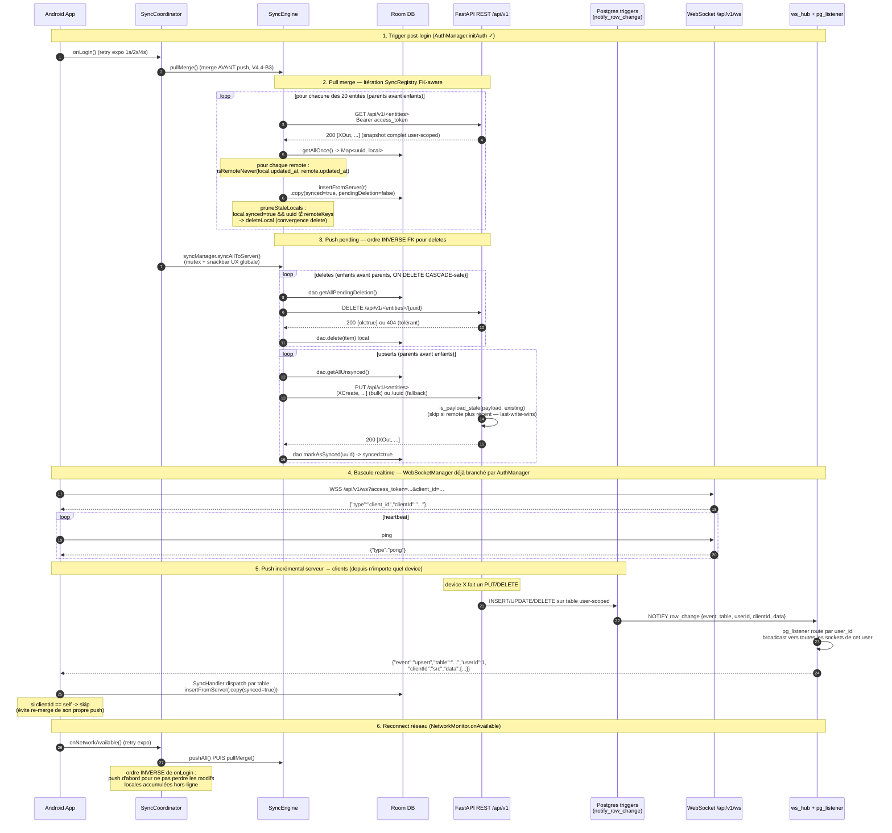

# SYNC_FLOW — Diagramme séquence

Flow de synchronisation client ↔ serveur post-login : pull/merge des 20 entités user-scoped (FK-aware) puis push des locaux unsynced, puis bascule sur le canal WebSocket pour les updates incrémentales en temps réel. Complète [SYNC_PATTERN.md](SYNC_PATTERN.md) (protocole 3-contrats sans tombstones) avec une vue temporelle des acteurs.

## Diagramme

## Notes

- **Ordre `merge-puis-push` au login (V4.4-B3)** : au login, l'user vient potentiellement d'un autre device → on affiche le state serveur en premier, puis on push les rares pending locaux (souvent vides). Inversé sur reconnect réseau : `push` d'abord pour ne pas perdre les modifs offline.
- **FK-aware** (`SyncRegistry.all` / `SyncRegistry.reversed`) : `pullMerge` et `pushAll` (upserts) itèrent dans l'ordre parents → enfants. `pushAll` (deletes) itère dans l'ordre inverse pour respecter `ON DELETE CASCADE` Postgres (enfants avant parents → évite 404 cascade).
- **Last-write-wins symétrique** : côté client `isRemoteNewer(local.updatedAt, remote.updatedAt)` (cf. [SYNC_PATTERN.md](SYNC_PATTERN.md)) ; côté serveur `is_payload_stale(payload, existing)` rejette les push older-than-existing (depuis 2026-05-07).
- **Convergence delete sans tombstone** : `pruneStaleLocals` (Phase 2 du merge) supprime les locaux `synced=true` absents du snapshot remote → propage les deletes d'un autre device sans `deleted_at`. Garde `synced=true` cruciale : préserve les créations locales offline jamais push (`synced=false`).
- **Retry exponentiel** (`SyncCoordinator.runWithBackoff`) : 3 tentatives 1s → 2s → 4s sur `onLogin` et `onNetworkAvailable` (triggers automatiques). `onUserAction` (bouton drawer / Settings) : pas de retry, snackbar erreur immédiate.
- **`clientId` WS** : chaque client génère un UUID stable et le passe via header `X-Client-Id` (POST/PUT/PATCH/DELETE) → le serveur le re-broadcast dans le payload WS → les autres devices savent qui a déclenché le change (et le device source peut skip son propre echo).

## Sources

- `appli-android/.../sync/SyncCoordinator.kt` — orchestration triggers (login / network / user) + backoff.
- `appli-android/.../sync/SyncEngine.kt` — `pushAll`, `pullMerge`, `pullReplace`, `bulkPushAll`, `pushEntityClass`.
- `appli-android/.../sync/SyncRegistry.kt` + 20 `SyncableEntity` — ordre FK-aware.
- `appli-android/.../sync/base/SyncMergeOps.kt` — `mergeFromRemote` (3-way merge + prune), `pullThenReplace`, `bulkPush`.
- `serveur/app/triggers_loader.py` + `app/db_triggers/*_trigger.sql` (20 fragments) — composition de `notify_row_change()`.
- `serveur/app/routers/ws_router.py` + `ws_hub.py` + `pg_listener.py` — broadcast par `user_id`.
- `serveur/app/crud/_concurrency.py` — `is_payload_stale` (last-write-wins serveur).
- [SYNC_PATTERN.md](SYNC_PATTERN.md) — protocole 3-contrats détaillé.
- [FLOWS.md §2-§3](FLOWS.md) — variante curl/JSON + format payload WS.
